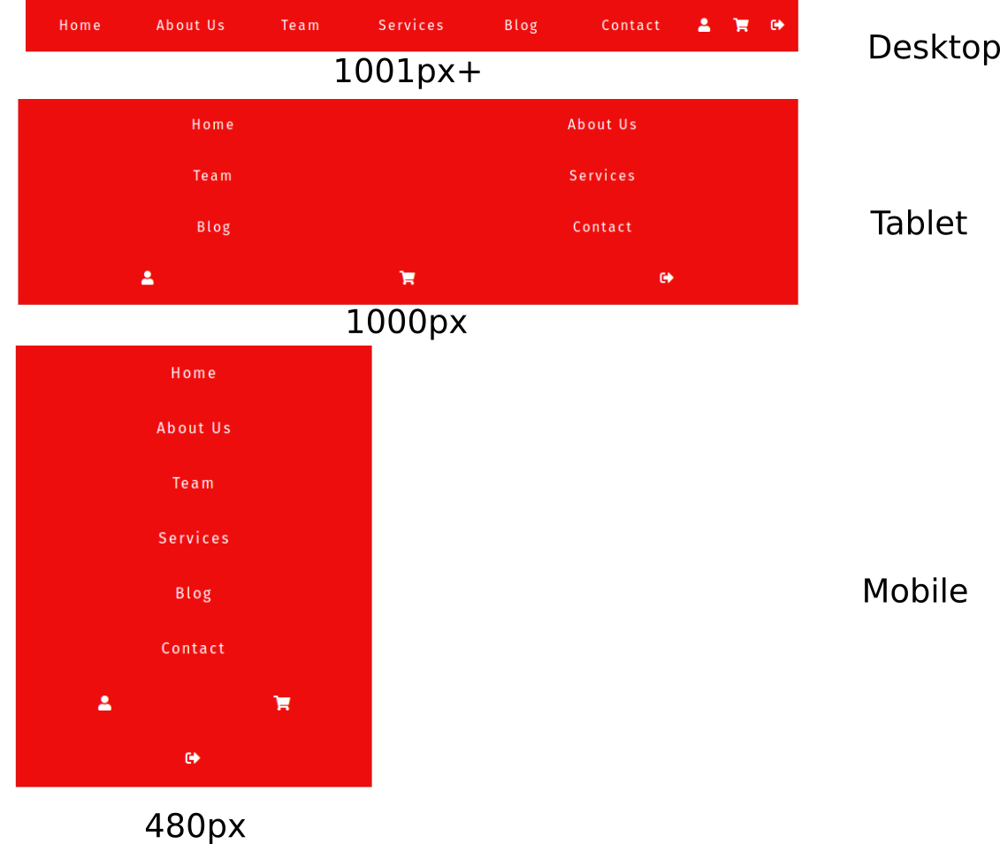

# Uma visão geral do CSS

[^CSSw3]

CSS é um idioma que usamos para estilizar uma página da web.

## O que é CSS?
- CSS significa folhas de estilo em cascata (Cascading Style Sheets)
- CSS descreve como os elementos HTML devem ser exibidos na tela, papel ou em outras mídias
- O CSS economiza muito trabalho. Ele pode controlar o layout de várias páginas da web de uma só vez
- Folhas de estilo externas são armazenados em arquivos CSS

## Por que usar CSS?

O CSS é usado para definir estilos para suas páginas da web, incluindo design, layout e variações na exibição para diferentes dispositivos e tamanhos de tela.

## CSS Solved a Big Problem

O HTML nunca pretendia conter tags para formatar uma página da web!

O HTML foi criado para descrever o conteúdo de uma página da web, como:

```htm
<h1>This is a heading</h1>
<p>This is a paragraph.</p>
```

Quando tags como `<font>` e atributos de cores foram adicionadas à especificação HTML 3.2, ele iniciou um pesadelo para desenvolvedores da Web. O desenvolvimento de sites grandes, onde fontes e informações de cores foram adicionadas a todas as páginas, tornaram-se um processo longo e caro.

Para resolver esse problema, o World Wide Web Consortium (W3C) criou o CSS.

O CSS removeu a formatação do estilo da página HTML!


## O CSS salva muito trabalho!

As definições de estilo são normalmente salvas em arquivos .css externos.

Com um arquivo de folha de estilo externo, você pode alterar a aparência de um site inteiro alterando apenas um arquivo!


## Sintaxe do CSS

Uma regra CSS consiste em um seletor e um bloco de declaração.


O seletor aponta para o elemento HTML que você deseja estilizar.

O bloco de declaração contém uma ou mais declarações separadas por ponto e virgula.

Cada declaração inclui um nome de propriedade CSS e um valor, separado por um dois pontos.

Várias declarações de CSS são separadas com ponto e virgula e os blocos de declaração são cercados por chaves.


```html
<!DOCTYPE html>
<html>
    <head>
        <style>
            p {
                color: red;
                text-align: center;
            } 
        </style>
    </head>
    <body>
        <p>Hello World!</p>
        <p>These paragraphs are styled with CSS.</p>
    </body>
</html>
```
## CSS Selectors

Um seletor CSS seleciona os elementos HTML que você deseja estilizar.

Os seletores CSS são usados para "encontrar" (ou selecionar) os elementos HTML que você deseja estilizar.

Podemos dividir os seletores de CSS em cinco categorias:

- Seletores simples (selecione elementos com base em nome, ID, classe)
- Seletores de combinadores (selecione elementos com base em um relacionamento específico entre eles)
- Seletores de pseudo-classe (selecione elementos com base em um determinado estado)
- Seletores de pseudo-elementos (selecione e estilo parte de um elemento)
- Seletores de atributos (selecione elementos com base em um atributo ou valor de atributo)

### O seletor de elementos CSS

O seletor de elementos seleciona elementos HTML com base no nome do elemento.

```html
<!DOCTYPE html>
<html>
<head>
<style>
p {
  text-align: center;
  color: red;
} 
</style>
</head>
<body>

<p>Every paragraph will be affected by the style.</p>
<p id="para1">Me too!</p>
<p>And me!</p>

</body>
</html>
```

### O seletor de ID do CSS

O seletor de ID usa o atributo ID de um elemento HTML para selecionar um elemento específico.

O ID de um elemento é único em uma página, portanto o seletor de ID é usado para selecionar um elemento exclusivo!

Para selecionar um elemento com um ID específico, escreva um caractere hash (#), seguido pelo ID do elemento.

```html
<!DOCTYPE html>
<html>
<head>
<style>
#para1 {
  text-align: center;
  color: red;
}
</style>
</head>
<body>

<p id="para1">Hello World!</p>
<p>This paragraph is not affected by the style.</p>

</body>
</html>
```

## Material extra


- [https://cssgridgarden.com/](https://cssgridgarden.com/)
- [http://www.csszengarden.com/](http://www.csszengarden.com/)

## Grid CSS

O Grid CSS oferece um sistema de layout baseado em grade, com linhas e colunas, facilitando o design de páginas da web sem precisar usar `float` e `position`.

::: normal-demo Demo

```html
<h1>Grid Layout</h1>

<p>This grid layout contains six columns and three rows:</p>

<div class="grid-container">
  <div class="item1">Header</div>
  <div class="item2">Menu</div>
  <div class="item3">Main</div>  
  <div class="item4">Right</div>
  <div class="item5">Footer</div>
</div>
```

```css
.item1 { grid-area: header; }
.item2 { grid-area: menu; }
.item3 { grid-area: main; }
.item4 { grid-area: right; }
.item5 { grid-area: footer; }

.grid-container {
  display: grid;
  grid-template-areas:
    'header header header header header header'
    'menu main main main right right'
    'menu footer footer footer footer footer';
  gap: 10px;
  background-color: #2196F3;
  padding: 10px;
}

.grid-container > div {
  background-color: rgba(255, 255, 255, 0.8);
  text-align: center;
  padding: 20px 0;
  font-size: 30px;
}
```

:::


## Criando Layouts com CSS Grid Layout

Demanda:  
> Eu preciso criar um layout com um cabeçalho, um menu lateral, o conteúdo principal e um rodapé


logo: 

```htm
<header>Cabeçalho</header>
<aside>Menu lateral</aside>
<main>Conteúdo principal</main>
<footer>Rodapé</footer>
```

agora precisamos posiciona-las da seguinte maneira:

- Header: Em cima da página
- Aside: Na parte esquerda da página
- Main: Na parte direita da página
- Footer: Em baixo da página

### Conhecendo o CSS Grid Layout

Como criar layouts era uma tarefa comum no dia-a-dia e às vezes um tanto quanto chata de se implementar em css (ou usando até `table` para posicionar elementos), a galera pensou: "Será que não seria possível melhorar esse processo, deixando mais rápido e eficiente?", foi nesse contexto que criou-se a nova funcionalidade chamada de CSS Grid Layout.

Nosso primeiro passo será definir qual tag vai receber as "lacunas" para posteriormente adicionarmos nossos elementos. Bom, se tudo esta dentro de body, temos um bom candidato:

```css
body {
  display: grid;
}
```

### Iniciando o posicionamento

::: normal-demo Grid

```html
<div class="grid-container">
<header>Cabeçalho</header>
<aside>Menu lateral</aside>
<main>Conteúdo principal</main>
<footer>Rodapé</footer>
</div>
```

```css
body {
  margin: 0;
  padding: 0;
  box-sizing: border-box;
}

.grid-container{
  background-color: blue;
  display: grid; 
  grid-template-columns: 1fr 3fr;
  grid-template-rows: 20vh 70vh 10vh;
}

header, aside, main, footer{
  background-color: red;
}

header{
  background-color: green;
  grid-column-start: 1;
  grid-column-end: 3;
  grid-row-start: 1;
  grid-row-end: 2;
}

aside{
  background-color: blue;
  grid-column-start: 1;
  grid-column-end: 2;
  grid-row-start: 2;
  grid-row-end: 3;
}

main{
  background-color: red;
  grid-column-start: 2;
  grid-column-end: 3;
  grid-row-start: 2;
  grid-row-end: 3;
}

footer{
  background-color: yellow;
  grid-column-start: 1;
  grid-column-end: 3;
  grid-row-start: 3;
  grid-row-end: 4;
}
```

:::

## grid-template-areas

A propriedade `grid-template-areas` especifica áreas dentro do layout de Grid.

Você pode nomear itens de grid usando a propriedade `grid-area` e, em seguida, referência ao nome na propriedade `grid-template-areas`.

Cada área é definida por aspas. Use um sinal de `.` para se referir a um item de grade sem nome.


::: normal-demo Grid Area

```html
<div class="grid-container">
<header>Cabeçalho</header>
<aside>Menu lateral</aside>
<main>Conteúdo principal</main>
<footer>Rodapé</footer>
</div>
```

```css
body {
  margin: 0;
  padding: 0;
  box-sizing: border-box;
}

.grid-container{
  background-color: blue;
  display: grid; 
  grid-template-columns: 1fr 3fr;
  grid-template-rows: 20vh 70vh 10vh;
  grid-template-areas: "header header"
                       "menu content"
                       "footer footer";
    
}

@media only screen and (max-width: 600px) {
  .grid-container {
    background-color: lightblue;
    grid-template-columns: 1fr;
    grid-template-rows: 15vh 15vh 60vh 10vh;
    grid-template-areas: "header "
                         "menu "
                         "content"
                         "footer ";
  }
}

header, aside, main, footer{
  background-color: red;
}

header{
  background-color: green;
  grid-area: header;
}

aside{
  background-color: blue;
  grid-area: menu;
}

main{
  background-color: red;
  grid-area: content;
}

footer{
  background-color: yellow;
  grid-area: footer;
}

```

:::

## Material extra/Referências

<iframe width="560" height="315" src="https://www.youtube.com/embed/HN1UjzRSdBk" title="YouTube video player" frameborder="0" allow="accelerometer; autoplay; clipboard-write; encrypted-media; gyroscope; picture-in-picture" allowfullscreen></iframe>

- [https://github.com/rocketseat-content/youtube-desvendando-css-grid](https://github.com/rocketseat-content/youtube-desvendando-css-grid)
- [https://www.alura.com.br/artigos/criando-layouts-com-css-grid-layout](https://www.alura.com.br/artigos/criando-layouts-com-css-grid-layout)
- [https://www.w3schools.com/css/css_grid.asp](https://www.w3schools.com/css/css_grid.asp)
- [https://css-tricks.com/snippets/css/complete-guide-grid/](https://css-tricks.com/snippets/css/complete-guide-grid/)
- [https://developer.mozilla.org/pt-BR/docs/Web/CSS/CSS_Grid_Layout](https://developer.mozilla.org/pt-BR/docs/Web/CSS/CSS_Grid_Layout)


## Flexbox CSS

[^flexbox_nav]

Com CSS Flexbox, é bastante prático codificar uma barra de navegação básica sem a necessidade de usar flutuadores ou cálculos complicados de pixels.

### O Layout





A barra de navegação consiste em uma lista desordenada com 9 links. Existem dois grupos de links. Os primeiros 6 links levam o usuário a diferentes páginas do site. Os últimos 3 são representados por ícones. Eles levam o usuário para sua página de perfil, para o carrinho de compras ou ajuda o usuário a fechar a sessão (na ordem).

O layout tem 3 pontos de interrupção:

- telas mais largas que 1001px – Desktop
- telas de 481px a 1000px – Tablet
- telas mais estreitas do que 480px – Mobile


### Criar o HTML

- Abra o seu editor de código preferido.
- Crie um arquivo HTML.

```html
<!DOCTYPE html>
<html lang="en">
<head>
   <meta charset="UTF-8">
   <meta name="viewport" content="width=device-width, initial-scale=1.0">
   <meta http-equiv="X-UA-Compatible" content="ie=edge">
   <title>Flexbox Navigation</title>
   <link rel="stylesheet" href="style.css">
   <link rel="stylesheet" href="https://cdnjs.cloudflare.com/ajax/libs/font-awesome/5.9.0/css/all.css">
   <link href="https://fonts.googleapis.com/css?family=Fira+Sans&display=swap" rel="stylesheet">
</head>
<body>
   <div class="main">
      <nav class="navigation">
         <ul>
            <li><a href="#">Home</a></li>
            <li><a href="#">About Us</a></li>
            <li><a href="#">Team</a></li>
            <li><a href="#">Services</a></li>
            <li><a href="#">Blog</a></li>
            <li><a href="#">Contact</a></li>
            <li class="user"><a href="#"><i class="fas fa-user"></i></a></li>
            <li class="user"><a href="#"><i class="fas fa-shopping-cart"></i></a></li>
            <li class="user"><a href="#"><i class="fas fa-sign-out-alt"></i></a></li>
         </ul> 
      </nav>
   </div>
</body>
</html>
```

- crie o style.css

```css
/* GLOBAL STYLES */

* {
    box-sizing: border-box;
 }
 
 body {
    font-family: 'Fira Sans', sans-serif;
    margin: 0;
 }

a {
   color: white;
   font-weight: 300;
   letter-spacing: 2px;
   text-decoration: none;
   background: rgb(238, 13, 13);
   padding: 20px 5px;
   display: inline-block;
   width: 100%;
   text-align: center;
}

a:hover {
   background: rgba(238, 13, 13, 0.75);
}

.main {
   max-width: 1200px;
   margin: 0 auto;
   padding: 0 3em 1.5em;
}

.navigation ul {
   border: 1px solid rgb(212, 20, 20);
   list-style: none;
   margin: 0;
   padding: 0;
   display: flex;
}

.navigation li {
   flex: 3;    
}

.navigation .user {
   flex: 1;
}

@media all and (max-width: 1000px) {
   .navigation ul {
      flex-wrap: wrap;
   }
   
   .navigation li {
      flex: 1 1 50%;
   }

   .navigation .user {
      flex: 1 1 33.33%;
   }
}

@media all and (max-width: 480px) {
   .navigation li {
      flex-basis: 100%;
   }

   .navigation .user {
      flex-basis: 50%;
   }
}

```

[CodePen](https://codepen.io/jorgemb76/pen/gNZqjm)


### Links extras

- [https://www.w3schools.com/css/css3_flexbox.asp](https://www.w3schools.com/css/css3_flexbox.asp)

## Frameworks CSS

[^w3css] [^getmdl] [^getbootstrap] [^bulma] [^tailwindcss] 


## pre processadores CSS

[^sassLand] [^precss] [^precssporonde]

## SASS vs LESS vs SCSS

[^SCSS]


## Referências

<!-- @include: ../bib/bib.md -->
