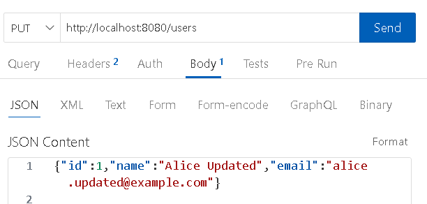

# JDBC, JPA, Spring Data

## JDBC

Para ilustrar a persistência de dados usando JDBC (Java Database Connectivity) e o banco de dados H2, vamos considerar uma aplicação Java simples que realiza operações CRUD (Create, Read, Update, Delete) em uma tabela de usuários. O banco de dados H2 será utilizado por ser leve, rápido, e fácil de configurar, ideal para ambientes de desenvolvimento e testes.

### Configuração do Ambiente

1. **Dependências**:
   - Você precisa adicionar a dependência do H2 e do JDBC ao seu projeto. Se estiver usando Maven, adicione o seguinte ao seu `pom.xml`:
 
 @[code{16-22}](../includes/jdbc/pom.xml)
 
1. **Conexão com o Banco de Dados**:
   - Vamos conectar ao banco de dados H2 usando JDBC. Crie uma classe `DatabaseConnection` que gerencia a conexão.

@[code](../includes/jdbc/src/main/java/br/edu/ifba/saj/ads/pweb/DatabaseConnection.java)

### Criando a Tabela de Usuários

Vamos criar uma tabela chamada `users` para armazenar os dados dos usuários.

@[code](../includes/jdbc/src/main/java/br/edu/ifba/saj/ads/pweb/CreateTable.java)

### Operações CRUD

Agora vamos implementar as operações CRUD usando JDBC.

1. **Create (Inserir um Novo Usuário)**:

@[code{9-23}](../includes/jdbc/src/main/java/br/edu/ifba/saj/ads/pweb/UserDAO.java)

2. **Read (Consultar Usuários)**:

@[code{25-42}](../includes/jdbc/src/main/java/br/edu/ifba/saj/ads/pweb/UserDAO.java)

3. **Update (Atualizar um Usuário)**:

@[code{44-59}](../includes/jdbc/src/main/java/br/edu/ifba/saj/ads/pweb/UserDAO.java)

4. **Delete (Remover um Usuário)**:

@[code{61-74}](../includes/jdbc/src/main/java/br/edu/ifba/saj/ads/pweb/UserDAO.java)


### Testando as Operações CRUD

Finalmente, você pode testar as operações implementadas. Aqui está um exemplo de como você pode usar a classe `UserDAO` para realizar operações CRUD:

@[code](../includes/jdbc/src/main/java/br/edu/ifba/saj/ads/pweb/Main.java)

##  JPA

**JPA (Java Persistence API)** é uma especificação Java para o gerenciamento de persistência de dados em aplicações. Ela abstrai a complexidade do JDBC, permitindo que os desenvolvedores trabalhem com entidades Java (objetos) em vez de escrever SQL manualmente. Vamos reescrever o exemplo anterior usando JPA com o banco de dados H2.

### Configuração do Ambiente

1. **Dependências**:
   - Para usar JPA com H2, você precisará adicionar as dependências do Hibernate (uma implementação popular do JPA) e do H2 ao seu projeto. Se estiver usando Maven, adicione o seguinte ao seu `pom.xml`:

@[code{16-32}](../includes/jpa/pom.xml)


2. **Configuração do `persistence.xml`**:
   - O `persistence.xml` é o arquivo de configuração principal para JPA, onde você define detalhes como a unidade de persistência e as propriedades do banco de dados. Crie este arquivo em `src/main/resources/META-INF/persistence.xml`:

@[code](../includes/jpa/src/main/resources/META-INF/persistence.xml)

   - **`hibernate.hbm2ddl.auto=update`**: Essa propriedade faz com que o Hibernate crie ou atualize as tabelas automaticamente com base nas entidades mapeadas.
   - **`hibernate.show_sql=true`**: Essa propriedade exibe o SQL gerado no console.

::: info

";NON_KEYWORDS=user" é utilizado para evitar que o H2 considere a palavra _user_ como palavra reservada e apresente erro ao criar a tebela `User`

:::

### Definição da Entidade `User`

A entidade `User` representará a tabela `users` no banco de dados.

@[code{8-16}](../includes/jpa/src/main/java/br/edu/ifba/saj/ads/pweb/User.java)

### Operações CRUD com JPA

Agora vamos criar a classe `UserDAO` para realizar operações CRUD usando JPA.

1. **Create (Inserir um Novo Usuário)**:
2. **Read (Consultar Usuários)**:
3. **Update (Atualizar um Usuário)**:
4. **Delete (Remover um Usuário)**:

@[code java{15,30,41,59}](../includes/jpa/src/main/java/br/edu/ifba/saj/ads/pweb/UserDAO.java)


### Testando as Operações CRUD

Finalmente, aqui está um exemplo de como você pode usar a classe `UserDAO` para realizar as operações CRUD:

@[code](../includes/jpa/src/main/java/br/edu/ifba/saj/ads/pweb/Main.java)

## Spring Data JPA


### Dependências

Adicione as seguintes dependências ao seu `pom.xml` para incluir o Spring Boot, Spring Data JPA e H2:


@[code{34-52}](../includes/spring-data/pom.xml)


### Configuração do Spring Boot

Configure o `application.properties` para usar o banco de dados H2 e Spring Data JPA:

@[code](../includes/spring-data/src/main/resources/application.properties)


::: info

";NON_KEYWORDS=user" é utilizado para evitar que o H2 considere a palavra _user_ como palavra reservada e apresente erro ao criar a tebela `User`

:::

::: tip

inicie a aplicação com o comando 

```terminal
mvn compile spring-boot:run
```

 e accesse o endereço [http://localhost:8080/h2-console](http://localhost:8080/h2-console)
:::


### Entidade 


@[code](../includes/spring-data/src/main/java/br/edu/ifba/saj/ads/pweb/model/User.java)

### Repositório

O Spring Data JPA simplifica a criação do repositório. Basta criar uma interface que estende `JpaRepository`.


@[code](../includes/spring-data/src/main/java/br/edu/ifba/saj/ads/pweb/repository/UserRepository.java)

### UserService

A classe `UserService` é responsável por gerenciar as operações relacionadas aos usuários da aplicação. Essa classe atua como uma camada intermediária entre o controlador (Controller, que recebe as requisições do usuário) e o repositório (repository, que interage com o banco de dados).

@[code](../includes/spring-data/src/main/java/br/edu/ifba/saj/ads/pweb/service/UserService.java)


- **@Service**: Esta anotação indica que a classe `UserService` é um componente Spring que lida com a lógica de negócios da aplicação.

- **@Autowired private UserRepository userRepository;**: Aqui, estamos injetando uma instância do `UserRepository` na classe UserService. O `UserRepository` é uma interface que fornece métodos para acessar os dados do usuário no banco de dados.

#### DTOs

Em aplicações que utilizam persistência de dados, como as que usam JDBC, JPA ou Spring Data JPA, é comum separar a camada de modelo em duas partes:

- **Entidades**: Representam as tabelas do banco de dados e são usadas para persistir os dados.
- **DTOs (Data Transfer Objects)**: São objetos simples usados para transferir dados entre as camadas da aplicação, como entre o controlador e a visão.
A necessidade de utilizar DTOs e mappers surge principalmente pelos seguintes motivos:

##### Separação de Responsabilidades e Encapsulamento:

- DTOs desacoplam a camada de apresentação da camada de persistência. 
  - Isso significa que a forma como os dados são exibidos na interface do usuário não está diretamente ligada à forma como são armazenados no banco de dados.
- Mudanças na estrutura do banco de dados não impactam diretamente a interface do usuário e vice-versa.
- Entidades podem conter informações sensíveis ou desnecessárias para a visualização, como senhas ou dados de auditoria. DTOs permitem expor apenas os dados relevantes para a interface do usuário.
##### Evitar Lazy Loading e Problemas de Serialização:

- Entidades JPA podem estar sujeitas a problemas de lazy loading, onde atributos são carregados sob demanda. Isso pode causar exceções se você tentar acessar esses atributos após a sessão do Hibernate ser fechada. DTOs, por serem objetos simples, evitam esse problema.
- Entidades JPA podem ter relacionamentos complexos que não são facilmente serializados para formatos como JSON. DTOs permitem controlar a serialização e enviar apenas os dados necessários para o cliente.

##### Validação e Adaptação de Dados:

- DTOs podem ter suas próprias regras de validação, diferentes das entidades. Isso permite validar os dados antes que sejam persistidos no banco de dados.
- DTOs podem ser usados para adaptar os dados para diferentes formatos ou necessidades da aplicação.

O mapper é responsável por converter entidades em DTOs e vice-versa. Ele atua como um tradutor entre as duas camadas, garantindo que os dados sejam transferidos corretamente.

###### Exemplo:

Imagine uma entidade `Usuario` com os atributos `id`, `nome`, `email` e `senha`. Você não gostaria de enviar a `senha` do usuário para o frontend! Um DTO `UsuarioDTO` poderia conter apenas os atributos `id`, `nome` e `email`. O mapper seria responsável por:

- Converter um objeto `Usuario` em um objeto `UsuarioDTO`, copiando os valores dos atributos `id`, `nome` e `email`.
- Converter um objeto `UsuarioDTO` em um objeto `Usuario`, copiando os valores dos atributos `id`, `nome` e `email` e, possivelmente, buscando a `senha` no banco de dados ou usando alguma lógica para defini-la.


### UserController

O `UserController` atua como um intermediário entre o mundo externo (requisições HTTP) e a lógica interna da sua aplicação relacionada aos usuários. Ele recebe as requisições, direciona-as para os serviços apropriados (`UserService` neste caso) e retorna as respostas formatadas (JSON) para o cliente (navegador, app mobile, etc.).

@[code](../includes/spring-data/src/main/java/br/edu/ifba/saj/ads/pweb/controller/UserController.java)


### Testando o Aplicativo

Inicie a aplicação Spring Boot e acesse o H2 Console em `http://localhost:8080/h2-console`. A URL JDBC para o console deve ser `jdbc:h2:file:./database/storage;NON_KEYWORDS=user`.

#### Exemplo de Uso Thunder ou Postman:

- **Adicionar Usuário**:


- **Obter Usuários**:


- **Atualizar Usuário**:




- **Excluir Usuário**:


