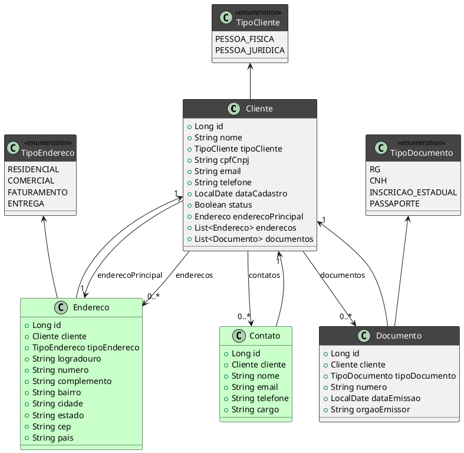
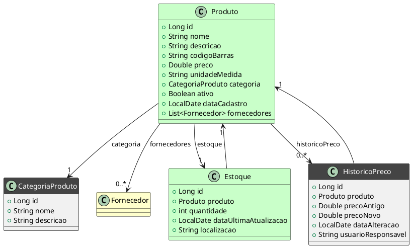
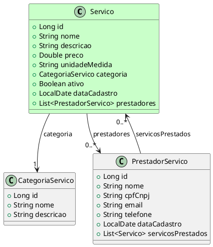
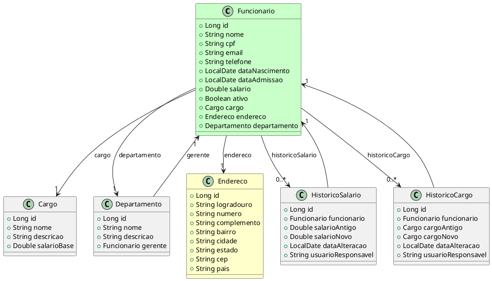
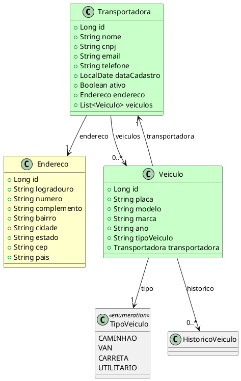
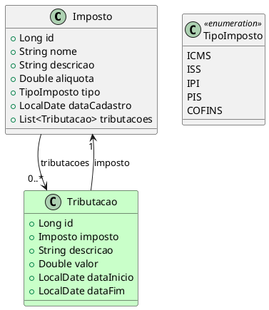
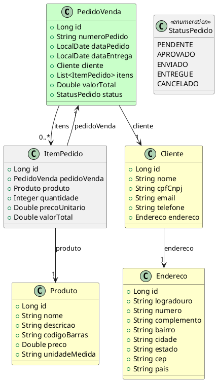
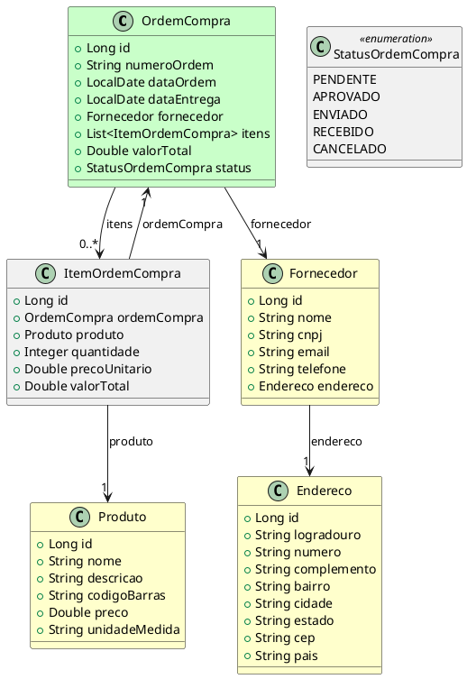
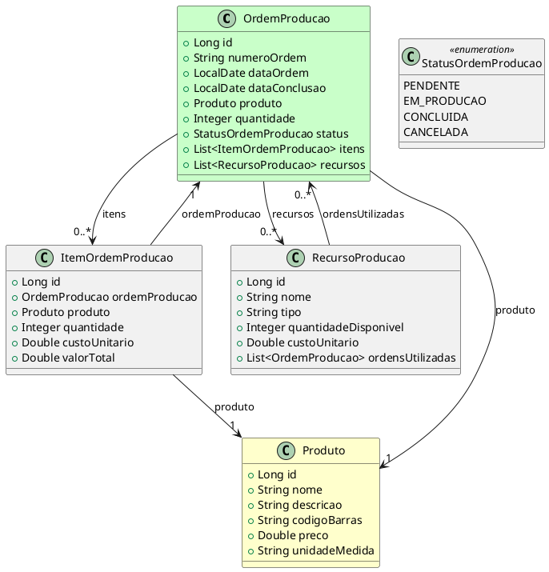
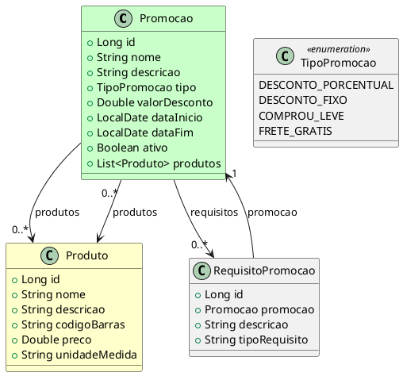

# Trabalho semestral 

## Descrição do Trabalho

Um sistema ERP (Enterprise Resource Planning) é uma solução integrada que auxilia na gestão de processos empresariais, fornecendo uma visão unificada das atividades da empresa.

Cada aluno deverá implementar um módulo do sistema ERP, utilizando a tecnologia Java (Spring Boot ou Quarkus) para o backend, e deve expor pelo menos uma funcionalidade através de uma API REST. Além disso, o módulo deverá fazer pelo menos uma requisição a um serviço externo por meio de um cliente REST no backend.

Para o desenvolvimento do front-end, o aluno possui liberdade para optar por qualquer framework JavaScript ou CSS, desenvolver a aplicação utilizando JavaScript puro (vanilla) ou até mesmo criar uma solução sem a utilização de JavaScript.

### Requisitos Funcionais
   
Na implementação do módulo escolhido deve conter as seguintes funcionalidades:
   - **CRUD (Create, Read, Update, Delete)**: Implementação completa das operações de cadastro das entidades do módulo
   - **API REST**: Expor pelo menos uma funcionalidade via endpoint REST. Exemplo: 
     - listar todos os clientes cadastrados 
     - buscar um produto pelo código, etc.
   - **Cliente REST**: O sistema deve consumir pelo menos um serviço REST externo. Exemplo: 
     - consultar a taxa de câmbio de uma API pública para um sistema financeiro, 
     - consultar informações tributárias, etc.

### Requisitos Não Funcionais
   - **Validações de Dados**: O módulo deve realizar validações adequadas dos dados (ex: validação de CPF/CNPJ no cadastro de clientes ou fornecedores).
   - **Persistência de Dados**: Utilizar um banco de dados relacional, como PostgreSQL, MySQL ou H2, para armazenar os dados do módulo.

### Tecnologias Obrigatórias
   - **Backend**: Java com Spring Boot ou Quarkus.
   - **Banco de Dados**: Relacional (PostgreSQL, MySQL ou H2).
   - **API REST**: Expor pelo menos uma funcionalidade com REST.
   - **Cliente REST**: Pelo menos uma integração com um serviço REST externo.
   - **Front-end**: HTML, CSS e JavaScript(com ou sem frameworks). 


### Lista de módulos

O módulo deverá ser implementado de forma isolada, mas de maneira que possa se integrar a outros módulos de um sistema ERP completo.

#### Cadastro de Clientes

Armazena informações sobre os clientes, como dados de contato, condições de pagamento, histórico de compras, entre outros.

<figure>



<figcaption>Cadastro de Clientes</figcaption>
</figure>

#### Cadastro de Fornecedores

Inclui informações sobre os fornecedores da empresa, como dados de contato, condições de fornecimento, formas de pagamento e produtos/serviços oferecidos.

<figure>


  ```plantuml
  	
  @startuml
  skinparam classFontColor automatic
  skinparam classHeaderBackgroundColor #444
  
  
  class Fornecedor #Technology{
      + Long id
      + String nome
      + String cnpj
      + String email
      + String telefone
      + LocalDate dataCadastro
      + Boolean status
      + Endereco enderecoPrincipal
      + List<Endereco> enderecos
  }

  class Endereco #Business{
      + Long id
      + Fornecedor fornecedor
      + TipoEndereco tipoEndereco
      + String logradouro
      + String numero
      + String complemento
      + String bairro
      + String cidade
      + String estado
      + String cep
      + String pais
  }

  class Contato #Business{
      + Long id
      + Fornecedor fornecedor
      + String nome
      + String email
      + String telefone
      + String cargo
  }

  class TipoEndereco <<enumeration>> {
      RESIDENCIAL
      COMERCIAL
      FATURAMENTO
      ENTREGA
  }

  Fornecedor --> "1" Endereco : enderecoPrincipal
  Fornecedor --> "0..*" Endereco : enderecos
  Fornecedor --> "0..*" Contato : contatos
  Endereco --> "1" Fornecedor
  Contato -> "1" Fornecedor
  TipoEndereco <- Endereco
  @enduml
  ```

<figcaption>Cadastro de Fornecedores</figcaption>
</figure>

#### Cadastro de Produtos

Contém dados sobre os produtos vendidos ou fabricados pela empresa, incluindo descrições, categorias, códigos de barras, preços e informações de estoque.

<figure>



<figcaption>Cadastro de Produtos</figcaption>
</figure>

#### Cadastro de Serviços

Mantém informações sobre os serviços oferecidos, como descrição, custo, tempo estimado de execução e preço.

<figure>


<figcaption>Cadastro de Serviços</figcaption>
</figure>

#### Cadastro de Funcionários

Armazena dados dos colaboradores, incluindo informações pessoais, cargos, salários, departamento, histórico de férias e contratos.

<figure>


<figcaption>Cadastro de Funcionários</figcaption>
</figure>

#### Cadastro de Transportadoras

Registra informações das empresas responsáveis pelo transporte de mercadorias, com contatos, tipos de serviço e regiões atendidas.

<figure>



<figcaption>Cadastro de Transportadoras</figcaption>
</figure>

#### Cadastro de Impostos e Tributações

Armazena informações sobre tributos aplicáveis às operações da empresa, como ICMS, ISS, IPI e suas respectivas alíquotas.

<figure>


<figcaption>Cadastro de Impostos e Tributações</figcaption>
</figure>

#### Cadastro de Pedidos de Venda

Registra e gerencia os pedidos realizados por clientes, com detalhes sobre produtos, quantidades, valores e prazos de entrega.

<figure>




<figcaption>Cadastro de Impostos e Tributações</figcaption>
</figure>

#### Cadastro de Ordens de Compra

<figure>

Registra as ordens de compra emitidas para fornecedores, contendo informações sobre os produtos/serviços adquiridos, valores e prazos de entrega.



<figcaption>Cadastro de Ordens de Compra</figcaption>
</figure>

#### Cadastro de Ordens de Produção 


Organiza e acompanha a produção de bens, com informações sobre matérias-primas, quantidades, prazos e fases do processo produtivo.

<figure>


<figcaption>Cadastro de Ordens de Produção</figcaption>
</figure>


#### Cadastro de Promoções e Descontos

Define e gerencia regras de promoções e descontos oferecidos pela empresa, seja por períodos específicos, campanhas ou para clientes selecionados.

<figure>


<figcaption>Cadastro de Promoções e Descontos</figcaption>
</figure>


## Entrega
- Código-fonte em repositório [Git](https://classroom.github.com/a/q0dfvJ58).
- Arquivo README com instruções de como rodar o projeto e informações sobre as dependências.
  
## Prazo: 30/09/2024.
